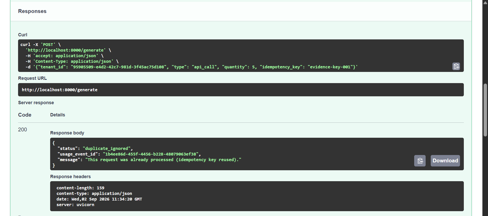
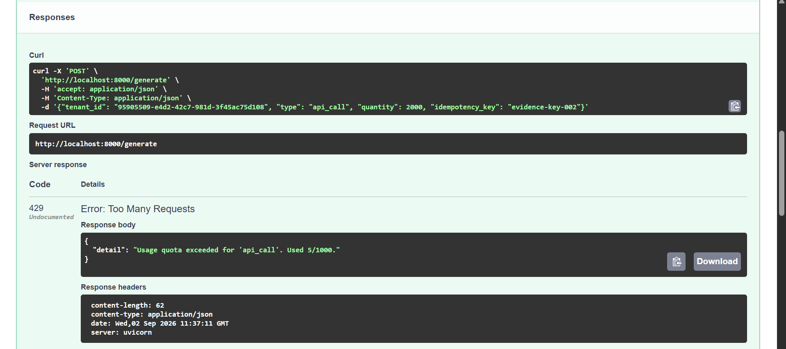
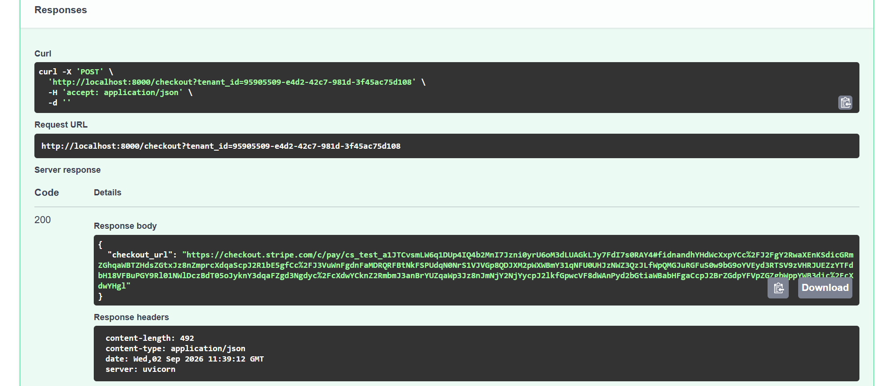
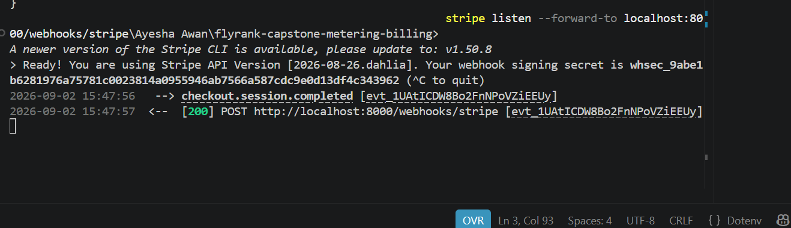
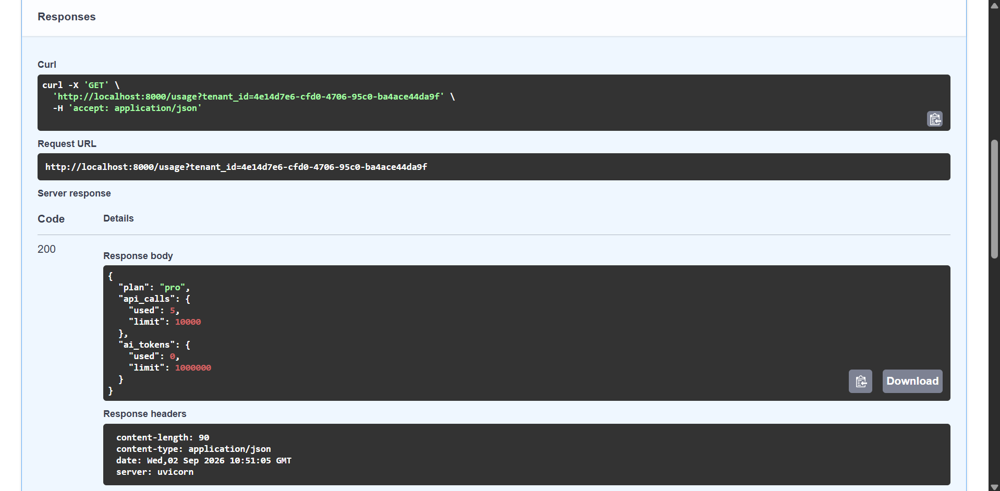
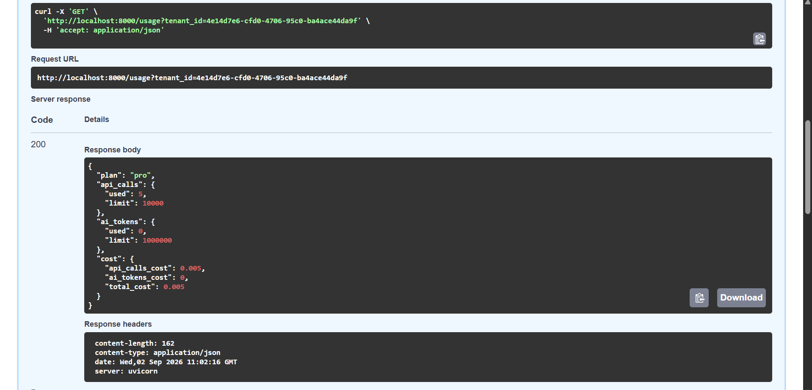

# Evidence

## Phase 2 — Core Billing Logic

### Idempotency confirmed

### Quota enforcement confirmed

## Part B — Stripe Integration

### Checkout session created successfully

### Webhook received and processed (200 OK)

### Tenant upgraded Free → Pro

## Part C — Cost Calculation

### Cost breakdown in /usage response
